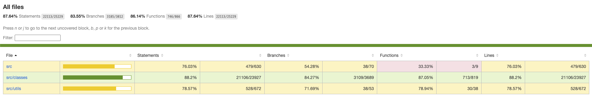
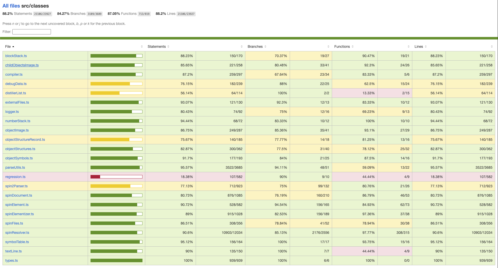
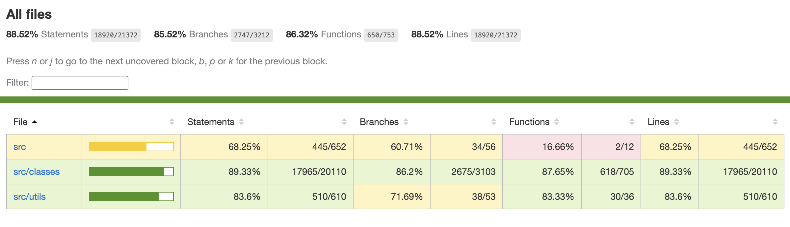
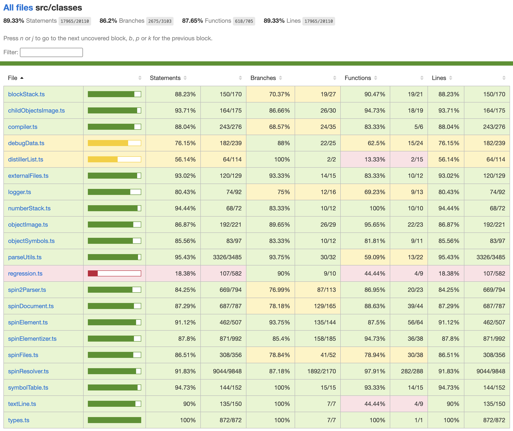

# PNut-TS - Coverage Testing

![Project Maintenance][maintenance-shield]

[![License][license-shield]](LICENSE)

![NodeJS][node-badge]

[![Release][Release-shield]](https://github.com/ironsheep/PNut-TS/releases)

[![GitHub issues][Issues-shield]](https://github.com/ironsheep/PNut-TS/issues)

## Coverage Status (each release)

The current coverage status is versioned at our repository. To view the full detail of our coverage reports:

- Create a local copy of our repository
 - Navigate to the directory you want to contain the repo clone.
 - Execute `git clone git@github.com:ironsheep/PNut-TS.git` to make your local copy 
 - The `clone` command makes the folder `./PNut-TS/`
- Navigate to `./PNut-TS/jest-coverage/lcov-report` within the newly cloned folder
- Open the file `index.html` in this folder with a web brawser. This is the Coverage Top level page
- Click on `src/classes` to get to the various class files making up PNut TS
- Click on `spinResolver.ts` to view the coverage for **SpinResolver Class** which does nearly all of our code generation

## Coverage Status v1.51.x (preliminary)


This is our coverage stataus at the v1.51.0 release.  In this release coverage effort we focused on the most important areas which would yield the best certification of the compiler in general. We didn't test many of the more extreme (infrequently exercised cases.) We did try to cover all regions that affect actual code generation.

### Page: Top level
Here are the coverage categories:

<br>**FIGURE 1**: v1.51.0 (prelim) `top-level` coverage report view.

This page shows that there are three pages below this one (`src`, `src/classes`, and `src/Utils` each with their own page of details.  Click on one of the three names to view the page for that group.

### Page: src/classes
Here is the `src/classes` status:

<br>**FIGURE 2**: v1.51.0 (prelim) `src/classes` coverage report view.

Again, this is our results at v1.51.0 (prelim) our preliminary v1.51.0 build just before we officially release.

## Coverage Status v1.43.x

This is our coverage stataus at the v1.43.0 testing release.  In this first coverage effort we focused on the most important areas which would yield the best certification of the compiler in general. We didn't test many of the more extreme (infrequently exercised cases.) We did try to cover all regions that affect actual code generation.

### Page: Top level
Here are the coverage categories:

<br>**FIGURE 1**: v1.43.0 `top-level` coverage report view.

This page shows that there are three pages below this one (`src`, `src/classes`, and `src/Utils` each with their own page of details.  Click on one of the three names to view the page for that group.

### Page: src/classes
Here is the `src/classes` status:

<br>**FIGURE 2**: v1.43.0 `src/classes` coverage report view.

Again, this is our results at v1.43.0 our initial test release.

## DEVELOPER NOTES - Running coverage

Running our coverage is a three step process.

## Step 1

Set up for running coverage with the command:

```bash
# npm run cov-setup
```

This step renames scripts and copies test files into place so that coverage can be run.

## Step 2

Run coverage with the command:

```bash
# npm run coverage
```

This step actually runs the coverage tests and ends by generating a full coverage report.

To review the report open `~/jest-coverage/lcov-report/index.html` with your browser.


## Step 3

Cleanup the coverage setup with the command:

```bash
# npm run cov-teardown
```

This restores the container to normal non-coverage mode. In this state you do normal builds and run the regression test suite, etc.

## Ensure you are NOT in coverage mode

**WARNING!**  When you are committing changes to the repostory please make sure that the repository is NOT in coverage mode. Many files are setup badly in this mode we don't want to check them in in this state! To see which mode the container is in just run:

```bash
# npm run cov-chk  # determine which mode the container is in

> p2-pnut-ts@0.43.0 cov-chk
> ./scripts/modeCov


modeCov: TEST/ALLCODE-tests is set up!  (Coverage Mode)
```

If you are seeing `Coverage Mode` then please run `cov-teardown` before committing any changes.  

```bash
# npm run cov-chk

> p2-pnut-ts@0.43.0 cov-chk
> ./scripts/modeCov


modeCov: TEST/ALLCODE-tests is torn down!  (Regression Mode)
```

If, instead you are seeing `Regression Mode` then coverage mode is NOT setup and you are ready to commit changes.

---

> If you like my work and/or this has helped you in some way then feel free to help me out for a couple of :coffee:'s or :pizza: slices or support my work by contributing at Patreon!
>
> [](https://www.buymeacoffee.com/ironsheep) &nbsp;&nbsp; -OR- &nbsp;&nbsp; [](https://www.patreon.com/IronSheep?fan_landing=true)[Patreon.com/IronSheep](https://www.patreon.com/IronSheep?fan_landing=true)

---

## License

Licensed under the MIT License.

Follow these links for more information:

### [Copyright](copyright) | [License](LICENSE)

[maintenance-shield]: https://img.shields.io/badge/maintainer-stephen%40ironsheep%2ebiz-blue.svg?style=for-the-badge

[license-shield]: https://img.shields.io/badge/License-MIT-yellow.svg

[Release-shield]: https://img.shields.io/github/release/ironsheep/PNut-TS/all.svg

[Issues-shield]: https://img.shields.io/github/issues/ironsheep/PNut-TS.svg

[node-badge]: https://img.shields.io/badge/node.js-6DA55F?style=for-the-badge&logo=node.js&logoColor=white
